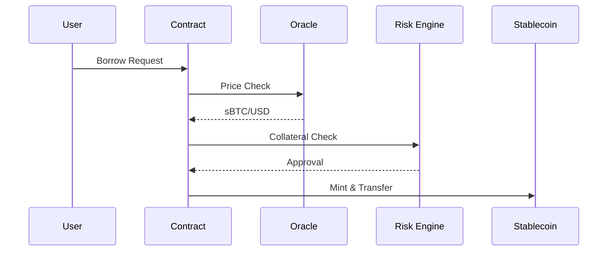

# sBTC Lending Protocol - Technical Documentation


## Table of Contents

- [sBTC Lending Protocol - Technical Documentation](#sbtc-lending-protocol---technical-documentation)
	- [Table of Contents](#table-of-contents)
	- [Protocol Overview ](#protocol-overview-)
	- [Key Features ](#key-features-)
	- [Technical Architecture ](#technical-architecture-)
		- [Core Components](#core-components)
	- [Smart Contract Specifications ](#smart-contract-specifications-)
		- [Contract Constants](#contract-constants)
		- [Protocol Configuration](#protocol-configuration)
		- [Data Structures](#data-structures)
	- [Core Functionality ](#core-functionality-)
		- [Collateral Management](#collateral-management)
		- [Loan Operations](#loan-operations)
		- [Liquidation Mechanism](#liquidation-mechanism)
	- [Risk Parameters ](#risk-parameters-)
	- [Administrative Controls ](#administrative-controls-)
		- [Governance Functions](#governance-functions)
		- [Emergency Features](#emergency-features)
	- [Security Model ](#security-model-)
		- [Defense Mechanisms](#defense-mechanisms)
		- [Audit Considerations](#audit-considerations)
	- [Integration Guide ](#integration-guide-)
		- [Required Interfaces](#required-interfaces)
		- [Integration Pattern](#integration-pattern)
	- [Error Reference ](#error-reference-)

## Protocol Overview <a name="protocol-overview"></a>

A non-custodial lending engine enabling Bitcoin holders to participate in DeFi through Stacks Layer 2. The protocol implements:

- sBTC-collateralized debt positions
- Programmatic stablecoin loans with compound interest
- Automated risk management system
- Decentralized liquidation mechanism
- Bitcoin-compatible DeFi operations

## Key Features <a name="key-features"></a>

- **Bitcoin-native Collateral**: sBTC wrapping maintains Bitcoin security guarantees
- **Institutional-grade Controls**: Configurable risk parameters and emergency stops
- **Capital Efficiency**: Dynamic interest rates and collateral optimization
- **Trustless Liquidations**: DEX integration for autonomous bad debt resolution
- **Transparent Accounting**: Block-based interest accrual with real-time updates

## Technical Architecture <a name="technical-architecture"></a>


### Core Components

1. **Collateral Vaults**
   - sBTC custody management
   - Real-time collateralization tracking
2. **Debt Engine**
   - Interest rate calculations
   - Loan lifecycle management
3. **Risk Management System**
   - Collateral ratio enforcement
   - Liquidation triggers
4. **Oracle Integration**
   - Price feed aggregation
   - Market data verification
5. **Liquidation Module**
   - DEX order routing
   - Penalty distribution

## Smart Contract Specifications <a name="smart-contract-specifications"></a>

### Contract Constants

| Constant                   | Value              | Description              |
| -------------------------- | ------------------ | ------------------------ |
| `CONTRACT-OWNER`           | Transaction sender | Initial deployer address |
| `ERR-NOT-AUTHORIZED`       | u1000              | Authorization failure    |
| `ERR-INSUFFICIENT-BALANCE` | u1001              | Balance check failure    |

### Protocol Configuration

```clarity
(define-data-var minimum-collateral-ratio uint u150)  ;; 150%
(define-data-var liquidation-threshold uint u125)     ;; 125%
(define-data-var liquidation-penalty uint u10)        ;; 10%
(define-data-var interest-rate-per-block uint u100)   ;; 0.01% per block
```

### Data Structures

**User Collateral Position**

```clarity
(define-map user-collateral
  { user: principal }
  { amount: uint }
)
```

**Loan Position**

```clarity
(define-map user-loans
  { user: principal }
  {
    borrowed-amount: uint,
    interest-accumulated: uint,
    last-interest-block: uint,
    liquidated: bool
  }
)
```

## Core Functionality <a name="core-functionality"></a>

### Collateral Management

**Deposit Flow**

1. sBTC transfer to contract
2. Collateral balance update
3. Global locked sBTC adjustment

**Withdrawal Conditions**

- Post-withdrawal collateral ratio ≥ 150%
- No outstanding liquidations
- Protocol operational status

### Loan Operations

**Borrow Process**



**Interest Calculation**

```
Interest = Principal × Rate × Blocks / 1000000
Where:
- Rate = 0.01% per block (u100)
- Blocks = Elapsed blocks since last update
```

### Liquidation Mechanism

**Trigger Conditions**

- Collateral ratio < 125%
- Loan not marked as liquidated
- Oracle price feed available

**Liquidation Process**

1. Collateral seizure
2. DEX market sell order
3. Debt settlement
4. Penalty application
5. Excess funds return

## Risk Parameters <a name="risk-parameters"></a>

| Parameter                | Default     | Description                             | Update Authority |
| ------------------------ | ----------- | --------------------------------------- | ---------------- |
| Minimum Collateral Ratio | 150%        | Minimum collateralization ratio         | Protocol Admin   |
| Liquidation Threshold    | 125%        | Collateral level triggering liquidation | Protocol Admin   |
| Liquidation Penalty      | 10%         | Additional penalty on liquidated debt   | Protocol Admin   |
| Interest Rate            | 0.01%/block | Per-block borrowing cost                | Protocol Admin   |

## Administrative Controls <a name="administrative-controls"></a>

### Governance Functions

```clarity
;; Update risk parameters
(update-minimum-collateral-ratio)
(update-liquidation-threshold)
(update-interest-rate)

;; Protocol management
(pause-protocol)
(unpause-protocol)
(add-authorized-address)
```

### Emergency Features

- Circuit breaker pattern implementation
- Time-locked parameter changes
- Multi-sig authorization requirements

## Security Model <a name="security-model"></a>

### Defense Mechanisms

1. **Oracle Safeguards**
   - Price feed validation
   - Multiple data source aggregation
2. **Liquidation Incentives**
   - Penalty-based economic security
   - DEX liquidity requirements
3. **Protocol Controls**
   - Minimum operation thresholds
   - Reentrancy protection
   - Block-based rate limiting

### Audit Considerations

- sBTC wrapper contract integrity
- Oracle price feed manipulation risks
- Interest calculation precision
- Edge case liquidation scenarios

## Integration Guide <a name="integration-guide"></a>

### Required Interfaces

**Price Oracle**

```clarity
(define-read-only (get-price)
  (ok uint)
```

**DEX Integration**

```clarity
(define-public (sell-sbtc (amount uint))
  (response (ok uint) (err uint))
```

### Integration Pattern

```javascript
// Sample borrowing flow
async function borrowStablecoin(amount) {
  const price = await oracleContract.getPrice();
  const collateralRatio = await lendingContract.getCollateralRatio(user);

  if (collateralRatio < MIN_RATIO) {
    throw new Error("Insufficient collateral");
  }

  const tx = await lendingContract.borrow(amount);
  await tx.confirm();
}
```

## Error Reference <a name="error-reference"></a>

| Error Code | Description                       | Resolution                    |
| ---------- | --------------------------------- | ----------------------------- |
| u1000      | Unauthorized access               | Verify sender permissions     |
| u1002      | Collateral ratio below minimum    | Add collateral or reduce debt |
| u1004      | Loan not eligible for liquidation | Check collateral status       |
| u1010      | Oracle price feed failure         | Verify oracle connectivity    |
